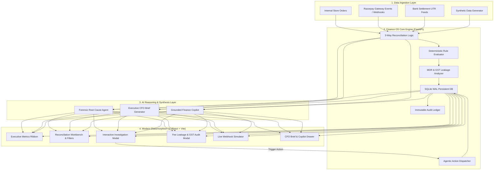

# 🛡️ FINANCE OS — Autonomous AI Finance Controller & 3-Way Reconciliation Engine

[](https://github.com)
[](https://fastapi.tiangolo.com)
[](https://reactjs.org/)
[](https://vitejs.dev/)
[](https://sqlite.org)
[](LICENSE)

> **FINANCE OS** is an enterprise-grade autonomous financial controller designed for modern e-commerce and fintech operations. It eliminates manual spreadsheet reconciliation by continuously matching **Internal Orders**, **Payment Gateway Transactions (Razorpay)**, and **Bank Settlement UTRs** using a dual-tier deterministic rule engine and an AI reasoning agent.

---

## 📌 Table of Contents
- [Executive Overview](#-executive-overview)
- [The Core Problem](#-the-core-problem)
- [Key Features](#-key-features)
  - [1. 3-Way Continuous Reconciliation Engine](#1-3-way-continuous-reconciliation-engine)
  - [2. Deep-Dive Root Cause Investigation](#2-deep-dive-root-cause-investigation)
  - [3. Agentic Self-Healing Action Dispatcher](#3-agentic-self-healing-action-dispatcher)
  - [4. MDR Fee Leakage & GST ITC Audit Engine](#4-mdr-fee-leakage--gst-itc-audit-engine)
  - [5. Boardroom Executive CFO Risk Brief](#5-boardroom-executive-cfo-risk-brief)
  - [6. Real-Time Webhook Ingestion Engine](#6-real-time-webhook-ingestion-engine)
  - [7. Grounded AI Finance Copilot](#7-grounded-ai-finance-copilot)
  - [8. Immutable Audit Trail & Persistent Storage](#8-immutable-audit-trail--persistent-storage)
- [System Architecture](#-system-architecture)
- [Project Directory Structure](#-project-directory-structure)
- [Quickstart & Installation](#-quickstart--installation)
- [API Reference](#-api-reference)
- [Live Demo & Presentation Script](#-live-demo--presentation-script)
- [Compliance & Security Standards](#-compliance--security-standards)

---

## 🏢 Executive Overview

In fast-scaling enterprises processing thousands of transactions daily, discrepancies between what an e-commerce platform sells, what payment gateways collect, and what banks deposit create millions in silent capital leakage.

**FINANCE OS** solves this end-to-end:
* Detects missing settlements, gateway overcharging, dropped webhooks, and double debits in sub-seconds.
* Pinpoints exact root causes and constructs balanced double-entry accounting journal entries.
* Executes autonomous remediation actions: triggering customer refunds, drafting gateway dispute claim letters, and exporting ERP journal entries.
* Audits MDR fees and verifies eligibility for 18% GST Input Tax Credit (ITC).

---

## ⚠️ The Core Problem

Traditional finance teams manually match CSV files at month-end using Excel VLOOKUPs. This causes:
1. **Capital Attrition**: Gateway fees are frequently miscalculated by 0.2%–0.5% beyond agreed Merchant Discount Rates (MDR).
2. **Unclaimed GST Credits**: Invoices for gateway processing fees are often mismatched, preventing companies from claiming 18% Input Tax Credit.
3. **Cash-Flow Blindspots**: Bank settlement delays (T+2 vs. T+1) remain invisible until month-end closing.
4. **Customer Friction**: Double charges or uncredited orders take days to identify and refund manually.

---

## 🚀 Key Features

### 1. 3-Way Continuous Reconciliation Engine
Performs multi-point validation across:
* **Source A: Internal Orders** (Order ID, Cart Value, Customer, Timestamp)
* **Source B: Gateway Transactions** (Payment ID, Status, Method, Gateway Fee, MDR)
* **Source C: Bank Settlements** (Settlement UTR, Net Deposited Amount, Batch ID)

Categorizes anomalies into:
* `MATCHED` — Perfect 3-way financial equilibrium.
* `AMOUNT_MISMATCH` — Discrepancies between cart total, charged amount, or settled amount.
* `MISSING_PAYMENT` — Order placed and marked paid in store, but no gateway capture exists.
* `DUPLICATE_PAYMENT` — Multiple successful charges detected against a single customer order.
* `UNKNOWN_PAYMENT` — Gateway capture without a corresponding internal store order.
* `SETTLEMENT_MISMATCH` — Discrepancy between gateway gross and bank net payout after fees.

### 2. Deep-Dive Root Cause Investigation
Clicking **Investigate** on any anomalous transaction opens a forensic analysis modal detailing:
* **Root Cause Breakdown**: Human-readable technical & financial post-mortem.
* **Evidence Chain**: Verifiable event timeline across order creation, gateway authorization, and bank batching.
* **Financial Impact & Exposure**: Exact quantitative capital at risk.
* **Double-Entry Journal Entry**: Accurate Debit/Credit entries (Accounts Receivable, Gateway Clearing, Fee Expense, Bank Cash).

### 3. Agentic Self-Healing Action Dispatcher
Go beyond passive monitoring with direct, executable remediation workflows:
* ⚡ **Trigger Automated Customer Refund**: Dispatches refund requests via gateway API with audit tracking.
* ✉️ **Generate Gateway Dispute Letter**: Composes formal dispute claim packets with order IDs, UTR references, and chargeback evidence.
* 📑 **Export ERP / SAP Journal**: Generates standard accounting journal files for SAP, NetSuite, or Tally.

### 4. MDR Fee Leakage & GST ITC Audit Engine
Continuously audits transaction fees against contracted pricing tiers (Credit Cards: 2.0%, Netbanking: 1.5%, UPI: 0.0%, Wallets: 1.8%):
* Detects fee overbilling and unapproved surcharges.
* Computes claimable **18% GST Input Tax Credit (ITC)** on eligible gateway processing charges.
* Quantifies recoverable revenue directly for the accounting team.

### 5. Boardroom Executive CFO Risk Brief
Generates an executive briefing document on demand:
* Comprehensive **Financial Health Score** (0–100).
* Match rate percentage and unresolved net financial exposure.
* Top 3 business vulnerability vectors (e.g., failure spikes in UPI autodebit).
* Prioritized strategic action items for finance leaders.

### 6. Real-Time Webhook Ingestion Engine
Simulates or receives production Razorpay webhooks (`payment.captured`, `order.paid`, `settlement.processed`):
* Interactive **Live Webhook** button injects instant transactions into the live ledger.
* Real-time ledger updates without requiring page reload.
* Ready for HMAC SHA256 signature verification in production.

### 7. Grounded AI Finance Copilot
An interactive sidecar chat assistant connected directly to the active ledger:
* Ask questions in plain English: *"Which UPI transactions have the highest exposure?"* or *"What is our total fee leakage?"*
* Grounded strictly in current reconciliation metrics to prevent hallucination.
* Provides direct hyperlinks to referenced transactions.

### 8. Immutable Audit Trail & Persistent Storage
* **Full Persistence**: Powered by SQLite with Write-Ahead Logging (WAL). All reconciliations, resolutions, and actions persist across reboots.
* **Immutable Audit Ledger**: Records every human or AI action (operator notes, status changes, refunds, exports) with timestamps and actor IDs.
* **CSV Export**: Instantly export the full reconciliation state with resolution notes for internal reporting.

---

## 🏛️ System Architecture



---

## 📂 Project Directory Structure

```
AI_Finance_Controller/
├── README.md                      # Comprehensive documentation & presentation guide
├── run_dev.bat                    # One-click launcher for both Backend & Frontend
├── start_backend.bat              # Standalone Backend launcher (FastAPI on 8000)
├── start_frontend.bat             # Standalone Frontend launcher (Vite on 5173)
├── backend/
│   ├── main.py                    # FastAPI application & REST endpoint controllers
│   ├── models.py                  # Pydantic schemas for data models, requests & responses
│   ├── reconciliation_engine.py   # Core 3-way matching, fee audit, and action logic
│   ├── database.py                # SQLite persistence layer and audit trail logging
│   ├── ai_agent.py                # AI analysis, CFO brief, and copilot reasoning engine
│   ├── synthetic_data.py          # Realistic multi-gateway financial dataset generator
│   ├── finance_os.db              # Persistent SQLite database file
│   ├── requirements.txt           # Python dependencies
│   └── tests/                     # Test suite
│       └── test_reconciliation.py # Automated engine tests
└── frontend/
    ├── index.html                 # HTML5 entry with Google Fonts (Plus Jakarta Sans)
    ├── package.json               # Node.js dependencies (Lucide icons, Vite, etc.)
    ├── vite.config.js             # Vite configuration with backend proxy
    └── src/
        ├── main.jsx               # React DOM root entry
        ├── App.jsx                # Main dashboard coordinator and state management
        ├── App.css                # Dark-mode glassmorphism design system
        ├── index.css              # Typography, CSS variables, and layout resets
        └── components/
            ├── Navbar.jsx                   # Brand header, primary action triggers
            ├── MetricsRibbon.jsx            # High-level financial KPIs & match rate cards
            ├── MoneyFlowVisualizer.jsx      # Sankey-style capital flow tracker
            ├── ReconciliationWorkbench.jsx  # Interactive filtering and transaction table
            ├── InvestigationModal.jsx       # Deep-dive forensic analysis & action dispatcher
            ├── FeeLeakageModal.jsx          # MDR fee audit and GST ITC recovery table
            ├── CfoBriefModal.jsx            # Executive boardroom risk summary
            ├── AiCopilotDrawer.jsx          # Context-grounded AI conversational sidecar
            ├── AuditTrailModal.jsx          # Immutable regulatory compliance history
            └── UploadCsvModal.jsx           # Custom CSV ingestion interface
```

---

## ⚡ Quickstart & Installation

### Prerequisites
* **Python 3.10+** installed and available in PATH.
* **Node.js 18+** and npm installed.

### Option A: One-Click Startup (Windows)
Simply double-click or run:
```bash
run_dev.bat
```
This automatically starts both the FastAPI backend (`http://localhost:8000`) and the Vite frontend (`http://localhost:5173`).

---

### Option B: Manual Step-by-Step Setup

#### 1. Backend Setup
```bash
cd backend
python -m venv venv
# Windows:
venv\Scripts\activate
# Linux/Mac:
source venv/bin/activate

pip install -r requirements.txt
python -m uvicorn main:app --reload --port 8000
```
Backend runs on: **`http://localhost:8000`** (Swagger docs available at `http://localhost:8000/docs`).

#### 2. Frontend Setup
Open a new terminal:
```bash
cd frontend
npm install
npm run dev
```
Frontend runs on: **`http://localhost:5173`**.

---

## 📡 API Reference

| Method | Endpoint | Description |
|---|---|---|
| `GET` | `/api/reconcile/summary` | Fetch global metrics, match rates, and exposure breakdown |
| `GET` | `/api/reconcile/transactions` | Query and filter transactions by status, severity, or search |
| `GET` | `/api/reconcile/transactions/{id}` | Retrieve individual transaction details and audit history |
| `POST` | `/api/reconcile/seed` | Seed fresh synthetic transactions (50–500 records) |
| `POST` | `/api/reconcile/upload` | Ingest user-provided Orders and Payments CSV files |
| `POST` | `/api/reconcile/resolve` | Mark an exception resolved with an operator audit note |
| `POST` | `/api/ai/investigate` | Generate AI forensic root cause and journal entries |
| `POST` | `/api/ai/chat` | Query the AI Finance Copilot with ledger grounding |
| `POST` | `/api/ai/cfo-brief` | Synthesize an executive strategic risk brief for the CFO |
| `POST` | `/api/actions/dispatch` | Dispatch an action (Refund, Dispute Letter, ERP Export) |
| `GET` | `/api/reconcile/fee-analytics` | Calculate MDR overcharges and GST ITC eligibility |
| `POST` | `/api/webhooks/simulate` | Ingest a live simulated payment/settlement event |
| `GET` | `/api/audit-trail` | Retrieve the chronological compliance audit log |
| `GET` | `/api/reconcile/export` | Download the full reconciled dataset as CSV |

---

## 🔒 Compliance & Security Standards

* **Audit Readiness**: Every status transition, action dispatch, and operator note is committed with timestamp and actor ID to the immutable audit ledger.
* **Double-Entry Verification**: Automatically generates balanced debits and credits for every transaction anomaly, maintaining GAAP/IFRS accounting integrity.
* **Statutory Tax Reconciliation**: Segregates payment processing costs from statutory 18% GST to optimize input tax credit claims under Indian GST laws.
* **Non-Destructive Persistence**: SQLite database uses standard transactions to prevent partial writes during high-frequency ingestion.

---

## 🏆 Built For
* **Razorpay Buildathon — Track 04 (Autonomous Finance & AI Controllers)**
* **Modern High-Velocity E-Commerce & FinTech Operators**
